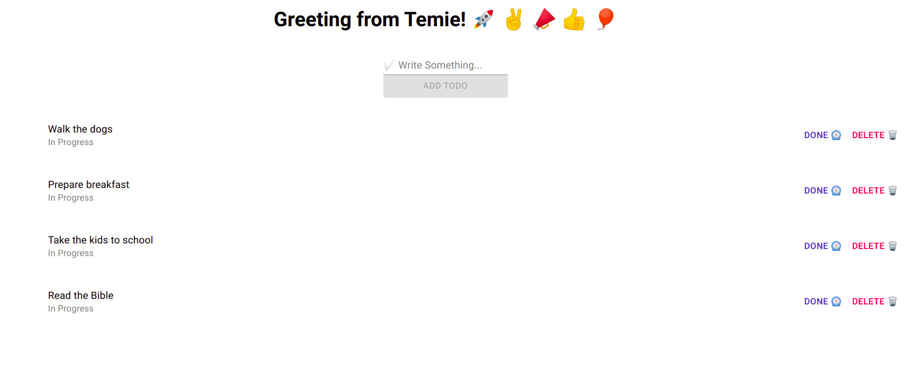

# Todo App React

Todo App React is a simple React project used to track daily todos. Firebase firestore database is used as a back-end database to store the daily todos; and the UI is styled using Material UI. A user can add, delete, view and toggle the progress of any todo.

## 🔴 Screenshot

### Home Page

## 🔴 Live Demo

### Click the following links below to see a Live Demo of the project

**[Netlify](https://todo-app-react-temesghen.netlify.app/) **

**[Firebase](https://todo-app-react-12b3e.web.app/) **

**[Heroku](https://todo-app-react-temesghen.herokuapp.com/) **

## Project Specification

- [ ] Use create-react-app to initialize a new React app
- [ ] Run the application with npm start and make sure that everything works correctly.
- [ ] Use create-react-app-buildpack to deploy the app to Heroku

## Built With

- [ ] Node.js
- [ ] React
- [ ] React DOM
- [ ] npm
- [ ] Material UI
- [ ] CSS
- [ ] ES6
- [ ] Netlify
- [ ] Firebase
- [ ] Heroku

## Author

👤 **Temesghen Tekeste**

- Github: [@temesghentekeste](https://github.com/temesghentekeste)
- Twitter: [@temesghentekes1](https://twitter.com/temesghentekes1)
- Linkedin: [temsghen tekeste](https://www.linkedin.com/in/temesghentekeste/)

## 🤝 Contributing

Contributions, issues and feature requests are welcome!

Feel free to check the [issues page](https://github.com/temesghentekeste/todo-app-react/issues).

## 👍 Show your support

Give a ⭐️ if you like this project!

## :clap: Acknowledgements

- <a href="https://www.microverse.org/" target="_blank">microverse.org</a>
- <a href="https://www.cleverprogrammer.com/" target="_blank">Clever Programmer</a>
  </a>
